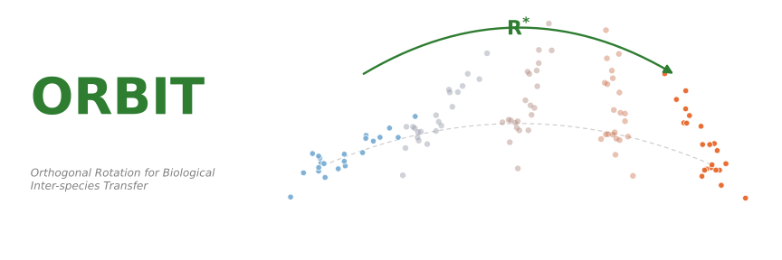

<p align="center">
  
</p>

# ORBIT — Orthogonal Rotation for Biological Inter-species Transfer

**Closed-form Procrustes rotation aligns plant coexpression network embeddings across species.**

This repository accompanies the manuscript:

> Wissenberg P., Lee J., Mutwil M. *ORBIT — Orthogonal Rotation for Biological Inter-species Transfer.* (2026). DOI: `[TODO: add once assigned]`

## Summary

ORBIT aligns gene-level Node2Vec embeddings derived from species-specific coexpression
networks into a single shared embedding space, enabling cross-species gene-function transfer.
We replace the SPACE autoencoder (Hu et al. 2025) with a closed-form orthogonal Procrustes
rotation fitted on Jaccard-weighted ortholog anchors and refined iteratively with cross-domain
similarity local scaling (CSLS). On the same data and evaluation protocol the Procrustes
pipeline improves cross-species retrieval by approximately 4× (Hits@50 0.106 vs 0.026 for
vanilla SPACE) at orders-of-magnitude lower wall-clock cost.

## What this repository ships

Data and aligned embeddings for the **five seed species** used as anchors in the
two-stage alignment:

- **ARATH** — *Arabidopsis thaliana* (eudicot)
- **ORYSA** — *Oryza sativa* (monocot)
- **PICAB** — *Picea abies* (gymnosperm)
- **SELMO** — *Selaginella moellendorffii* (lycophyte)
- **MARPO** — *Marchantia polymorpha* (liverwort)

Specifically:

- **Coexpression networks** (gzipped) — `data/networks/{CODE}.tsv.gz` (~54 MB total)
- **Procrustes-aligned embeddings** (gzipped, the published Procrustes + Jaccard + iterative + CSLS variant) — `results/aligned_embeddings/{CODE}.h5.gz` (~81 MB total)

To reproduce alignment for additional species, run the full pipeline below on your own
coexpression networks.

## Installation

Python 3.12 with [`uv`](https://docs.astral.sh/uv/). An NVIDIA GPU with CUDA 12 is recommended
(used for FAISS similarity search and Jaccard matrix computation).

```bash
git clone https://github.com/pwissenberg/orbit.git
cd orbit
uv sync                                # install dependencies
uv pip install -e ../SPACE             # SPACE library (clone https://github.com/deweihu96/SPACE alongside)
```

The compatibility shim `orbit._compat` patches deprecated NumPy aliases so the
upstream SPACE / pecanpy code runs on modern NumPy. Import it before any SPACE imports.

## Quick start

### Reproduce the embedding step on the bundled networks

```bash
uv run python scripts/example_embed_seeds.py
```

Writes Node2Vec H5 embeddings to `data/node2vec/{species}.h5` (128-dim float32,
hyperparameters match the paper: p = 1.0, q = 0.7, num_walks = 20, walk_length = 50,
epochs = 10).

### Find cross-species nearest neighbors with the published aligned embeddings

```python
import gzip, io, h5py, numpy as np

def load_h5gz(path):
    with gzip.open(path, "rb") as f:
        with h5py.File(io.BytesIO(f.read())) as h:
            proteins = [p.decode() if isinstance(p, bytes) else p for p in h["proteins"][:]]
            return proteins, h["embeddings"][:]

q_proteins, q_emb = load_h5gz("results/aligned_embeddings/ARATH.h5.gz")
t_proteins, t_emb = load_h5gz("results/aligned_embeddings/ORYSA.h5.gz")

idx = next(i for i, g in enumerate(q_proteins) if g.startswith("AT1G29910"))  # Lhcb1.1
qn = q_emb[idx] / np.linalg.norm(q_emb[idx])
tn = t_emb / np.linalg.norm(t_emb, axis=1, keepdims=True)
for i in np.argsort(-(tn @ qn))[:10]:
    print(f"{t_proteins[i]}\t{(tn @ qn)[i]:.3f}")
# top hits are rice Lhcb-family genes (LOC_Os04g33830.1, ...)
```

## Pipeline

The full pipeline (seed selection → data prep → alignment → evaluation) is reproducible
end-to-end. Each stage is a CLI script under `scripts/`:

| Stage | Command | Purpose |
|-------|---------|---------|
| 1. Seeds | `uv run python scripts/select_seeds.py --k 5 --plot` | Select anchor species via p-dispersion on OrthoFinder distances |
| 2. Data prep | `uv run python scripts/prepare_data.py --all` | Clean networks, train Node2Vec, build ortholog pairs |
| 3. Procrustes alignment | `uv run python scripts/run_improved_procrustes.py --stage all --weighting jaccard --iterative --csls` | Two-stage Procrustes with Jaccard weighting, iterative refinement, CSLS |
| 4. Cross-species evaluation | `uv run python scripts/evaluate.py --mode all` | Hits@k, Spearman correlation against orthogroup co-membership |
| 5. Within-species evaluation | `uv run python scripts/eval_raw_n2v_within.py` | Verify within-species coexpression structure is preserved |
| 6. Statistics | `uv run python scripts/compute_statistical_tests.py` | Mann–Whitney U on ortholog vs random pairs |
| 7. Downstream | `evaluate_func_pred.py`, `evaluate_subloc.py`, `evaluate_go_transfer.py` | GO prediction, subcellular localization, cross-species GO transfer |
| 8. Benchmark | `uv run python scripts/benchmark_runtime.py` | Wall-clock comparison: SPACE autoencoder vs Procrustes |

The legacy SPACE autoencoder pipeline is preserved in `scripts/run_alignment.py` and
`scripts/run_jaccard_improvement.py` for direct comparison.

## Bringing your own species

To extend alignment to species beyond the bundled seeds, you need:

- **Coexpression networks** — TEA-GCN: <https://github.com/mutwil/TEA-GCN>
- **Orthogroups** — OrthoFinder v2.5+: <https://github.com/davidemms/OrthoFinder>
- **(Optional) ProtT5 protein embeddings** — Rostlab/prot_t5_xl_uniref50, used for the downstream
  classification baselines
- **(Optional) GO annotations** — UniProt-GOA experimental evidence
  (<https://ftp.ebi.ac.uk/pub/databases/GO/goa/proteomes/>)
- **(Optional) Subcellular localization** — DeepLoc 2.0
  (<https://services.healthtech.dtu.dk/services/DeepLoc-2.0/>)
- **SPACE library** — <https://github.com/deweihu96/SPACE>

Place inputs at the paths expected by `scripts/prepare_data.py` and run the pipeline.

## Repository layout

```
src/orbit/                        # Python package (data prep, alignment, eval, viz)
scripts/                          # CLI entry points for each pipeline stage
tests/                            # pytest unit tests
data/networks/                    # 5 seed-species coexpression networks (gzipped)
data/                             # small reference files: species names, seeds, taxonomy
results/                          # headline JSON results and downstream summaries
results/aligned_embeddings/       # 5 seed-species Procrustes-aligned embeddings (gzipped)
results/supplementary/            # supplementary tables (CSV) and figures (PDF + PNG)
report_figures/                   # final figure files used in the paper
```

## Citation

```bibtex
@unpublished{wissenberg2026orbit,
  title  = {ORBIT --- Orthogonal Rotation for Biological Inter-species Transfer},
  author = {Wissenberg, Paul and Lee, Jiamin and Mutwil, Marek},
  year   = {2026},
  note   = {Manuscript},
}
```

## License

Released under the MIT License. See [`LICENSE`](LICENSE).
