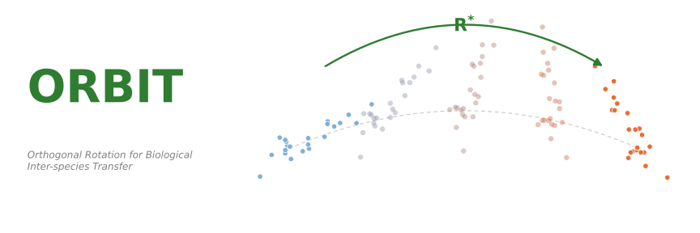

<p align="center">
  
</p>

# ORBIT: Orthogonal Rotation for Biological Inter-species Transfer

**Closed-form orthogonal Procrustes rotation that aligns gene network embeddings across species.**

This repository accompanies the manuscript:

> Wissenberg P., Lee J. M., Mutwil M. *ORBIT: Orthogonal Rotation for Biological Inter-species Transfer.* (2026). DOI: `[TODO: add once assigned]`
>
> Aligned embeddings (five plant seed species and 1,322 STRING species): Zenodo DOI [10.5281/zenodo.22816523](https://doi.org/10.5281/zenodo.22816523)

## What it does

ORBIT places independently trained gene network embeddings (Node2Vec, one per species) into one
shared space so that genes can be compared across species. Each species is rotated onto a
reference by a closed-form orthogonal Procrustes rotation, solved with one SVD and anchored on
ortholog pairs. There is nothing to train and no hyperparameter; the rotation preserves every
within-species distance exactly. Many species are handled in two stages: a few seed species are
rotated onto the reference, every other species onto the seed with which it shares the most
orthogroups.

One command, `orbit align`, runs both data tracks of the paper:

| Track | Embeddings | Anchors | Reference and seeds |
|-------|------------|---------|---------------------|
| Plant coexpression networks, 153 species | Node2Vec of TEA-GCN networks (`orbit embed`) | OrthoFinder orthogroups, one row per ortholog pair | *A. thaliana* (ARATH) and 4 more seeds |
| STRING protein networks, 1,322 eukaryotes | Node2Vec released with SPACE (`orbit fetch string`) | eggNOG orthogroups, one centroid row per shared orthogroup | *H. sapiens* (9606) and the 48 SPACE seeds |

## Installation

Python 3.10 or newer with [`uv`](https://docs.astral.sh/uv/). Everything runs on a laptop CPU.

```bash
git clone https://github.com/pwissenberg/orbit.git
cd orbit
uv sync                  # numpy + scipy + h5py: the rotation
uv sync --extra embed    # additionally pecanpy + gensim, for `orbit embed`
uv run orbit --help
```

## Aligned embeddings on Zenodo

All aligned embeddings of the paper are archived under DOI
[10.5281/zenodo.22816523](https://doi.org/10.5281/zenodo.22816523): `ARATH.h5`, `ORYSA.h5`,
`PICAB.h5`, `SELMO.h5`, `MARPO.h5` for the five plant seed species and
`orbit_string_ppi_aligned_v1.tar` with one `<NCBI taxid>.h5` per STRING species, plus manifests
and checksums. Every `.h5` file holds two datasets, `proteins` (gene or protein identifiers) and
`embeddings` (float32, n x 128):

```python
import h5py
with h5py.File("ARATH.h5") as f:
    ids = [p.decode() for p in f["proteins"][:]]
    X = f["embeddings"][:]            # (n_genes, 128) float32
```

Because ORBIT is a rotation, within-species distances and cosine similarities equal those of
the unaligned Node2Vec input; only cross-species comparisons change. This repository bundles
gzipped copies of the five plant files (`results/aligned_embeddings/`, 80 MB) and the five seed
coexpression networks (`data/plant/networks/`, 52 MB).

## Quick start: run the rotation

`orbit align` takes the same three inputs for either track: a directory of `<species>.h5`
embeddings, a seeds file with one identifier per line, and an orthogroup source. A directory
of OrthoFinder tables gives pair anchors, an eggNOG members file gives centroid anchors. It
writes one `<species>.h5` per species plus `alignment_report.tsv` (role, seed, anchor count).

### STRING protein networks

```bash
uv run orbit fetch string --taxa 1450537 5888 39947    # the 48 seeds plus these non-seeds, ~0.7 GB
uv run orbit align --embeddings data/string/node2vec --orthogroups data/string/eggnog/2759.tsv.gz \
    --seeds data/string/seeds.txt --reference 9606 --allow-reflection --out results/string
```

The result for a non-seed equals the full run, because a non-seed depends only on the seeds;
`orbit fetch string --all` and `orbit align` without restriction reproduce all 1,322 files of
the Zenodo archive (7.6 GB of input, minutes of alignment, about 3 GB of memory: only the
seeds and the species being placed are held at a time, plus the orthogroup table). The
released STRING files were solved with the unconstrained orthogonal Procrustes solution,
which is a reflection (det R = -1) for part of the species; `--allow-reflection` reproduces
them to within 2e-9, the float32 rounding of a different BLAS. Without it every rotation is
proper (det R = +1), as for the plant track.

### Plant coexpression networks

Inputs: `data/plant/node2vec/<SPECIES>.h5` (Node2Vec of the TEA-GCN networks),
`data/plant/orthogroups/<SPECIES>_transcripts_to_OG.tsv` (OrthoFinder v3.1.0 on the same
species) and `data/plant/seeds.txt`.

```bash
uv run orbit embed data/plant/networks/*.tsv.gz --out data/plant/node2vec     # SPACE defaults, needs --extra embed
uv run orbit align --embeddings data/plant/node2vec --orthogroups data/plant/orthogroups \
    --seeds data/plant/seeds.txt --reference ARATH --assignment data/plant/seed_assignment.json \
    --out results/plant
```

`data/plant/seed_assignment.json` pins each of the 148 non-seed species of the paper to its
seed (Table S7). That assignment was made during seed selection by the smallest Jaccard
distance between orthogroup sets, a normalised form of the same overlap; without
`--assignment` the seed with the most shared orthogroups is used, which can differ for
individual species, so pass the file to reproduce the paper.
Node2Vec is stochastic, so embeddings made with `orbit embed` reproduce the procedure of the
paper, not its files.

### Add your own species to the released frame

Run OrthoFinder on the proteomes of the five seed species together with your species, so that
all six tables share orthogroup identifiers. Put the released seed files (unzipped) and your
species' Node2Vec file in one directory, the six OrthoFinder tables in another, and skip
stage 1:

```bash
uv run orbit align --embeddings my/embeddings --orthogroups my/orthogroups --seeds data/plant/seeds.txt \
    --reference ARATH --seeds-aligned --species MYSPEC --out results/mine
```

### Input formats

- Embeddings: HDF5 with datasets `proteins` and `embeddings` (float32, n x d); the file name is the species identifier.
- OrthoFinder: `<SPECIES>_transcripts_to_OG.tsv` with columns `Transcript_ID`, `Protein_ID`, `Orthogroup`.
- eggNOG: a members table `<level>.tsv.gz` as distributed with SPACE (orthogroup in column 2, members `<taxid>.<protein>` in the last column).
- Networks for `orbit embed`: `geneA<TAB>geneB<TAB>weight`, gzipped or plain, e.g. from [TEA-GCN](https://github.com/mutwil/TEA-GCN).

### Library

```python
from orbit.align import procrustes_rotation, rotate
R = procrustes_rotation(anchors_source, anchors_reference)   # (k, d) paired anchor rows -> (d, d)
aligned = rotate(embeddings_source, R)                        # every gene of the source species
```

## Repository layout

```
src/orbit/align.py            the rotation: procrustes_rotation, two_stage_rotations
src/orbit/anchors.py          ortholog anchors: OrthoFinder pairs, eggNOG centroids, nearest seed
src/orbit/io.py               HDF5 layout of the embedding files
src/orbit/cli.py              orbit align | fetch | embed
src/orbit/fetch.py            STRING inputs from Zenodo record 15600639
src/orbit/embed.py            Node2Vec with the SPACE defaults (optional extra)
data/plant/                   seeds.txt, seed_assignment.json, 5 seed networks; orthogroups/ and node2vec/ are inputs you provide
data/string/                  written by `orbit fetch string` (not tracked)
results/aligned_embeddings/   the 5 released plant files (gzipped)
tests/                        pytest, including one end-to-end run per track on synthetic data
```

## Citation

```bibtex
@unpublished{wissenberg2026orbit,
  title  = {ORBIT --- Orthogonal Rotation for Biological Inter-species Transfer},
  author = {Wissenberg, Paul and Lee, Jia Min and Mutwil, Marek},
  year   = {2026},
  note   = {Manuscript},
}
```

## License

Released under the MIT License. See [`LICENSE`](LICENSE).
